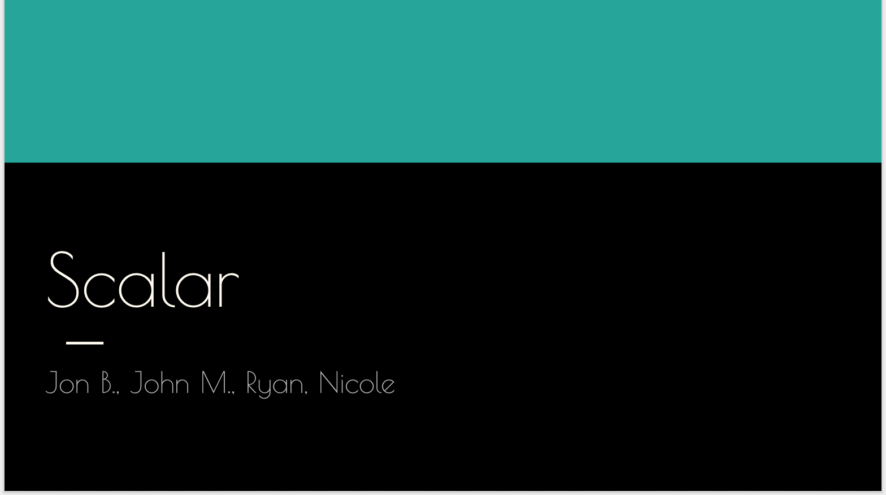
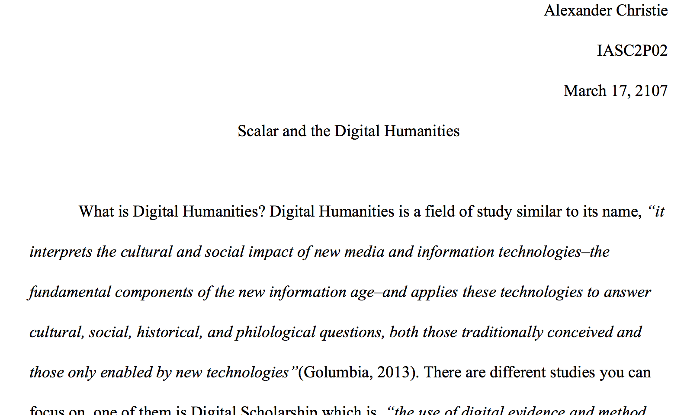
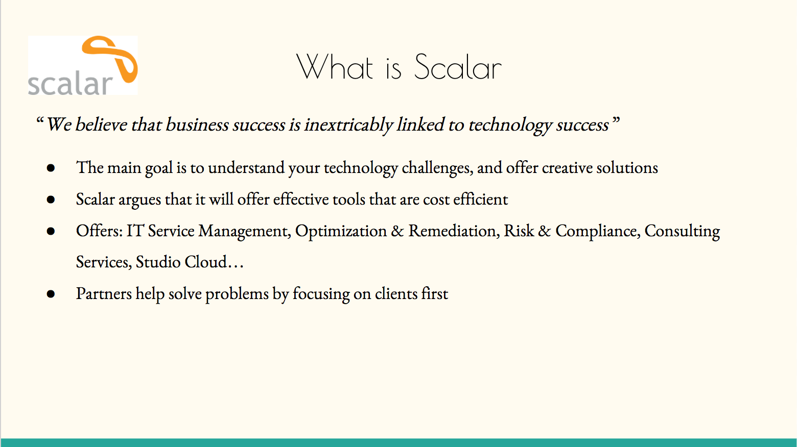

<a href="https://nicoleboccia.github.io/portfolio/">Back</a>
<h1>Scalar</h1>

<h2>Project Description</h2>

	Scalar is an open source, free publishing platform designed for authors to write long-form, born-digital scholarship online. The tool enables the users to build media by multiple sources and combine them with their own writing in a variety of ways (Scalar, 2016). This can be considered a Digital Humanities project, as well as Digital Scholarship because the tool allows the user to publish scholarly text in a variety of creative and interactive ways. For example videos, charts, links, and so much more can be added because in Scalar, “anything can do everything to anything” (Scalar, 2016).

<h2>Collaboration Statement</h2> 

Using collaborative scholarship for this project was helpful when splitting up the work, and helpful to the team members knowledge of the topic as well. Our group presented "Scalar", though we all had different parts, the team had the same understanding as to what the website does by interacting and trying it out. There was some confusion at first on my part, but I quickly found a solution and now have a better understanding of the topic.

Collaboration enriches my academic thinking by first researching a topic then interacting with it. By doing this even if it is not my part, I can fully inderstand what the tool does and why it was made. My part of the project was to expalin to the class what Scalar is by researching background information, going to thier website. However for everyone to fully do thier part they need to use the tool, so if asked any questions they can easily answer them. When working in a team the best workflow is to keep in contact, and ensure everyone in the team is doing thier part correctly. Our team did this by setting up two group meetings, sending emails, and contacting each member until we heard a response.

Collaboration in the Digital Humanities is very important. This field is innovative, technical, and requires research taken and used by several people. Different tools are used with the influence of history, and literature in the Humanities so there is constantly a demand for collaboration of people as well as the tools.

